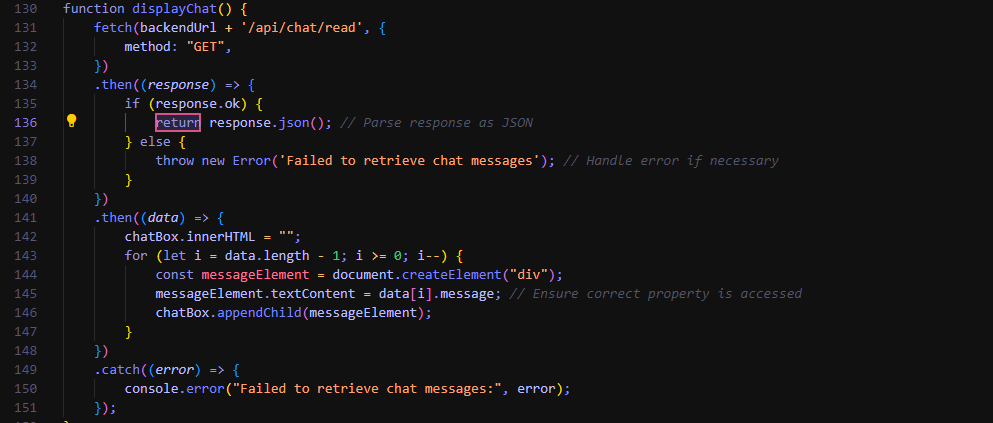

### WHAT I DID
My main participation within our project would be detailing and fixing different errors that would occur based on how our code worked or how errors would occur over the period of our project. It was a great help with the participation of others within my group that we were all able to work on our seperate pieces and pages tnat we were assigned, only requiring the aid of others when severely needed. The game that I had created consisted of a flappybird style dodging game, mostly consisted of javascript and following the style of our website.

### N@TM
Our idea for our project would be to create a gaming website, somewhat like that of Cool Math Games, consisting of a variety of games that all revlove around the same theme (Initially it was 8-bit pixel, but we later switched to space). We wanted to advance beyond what Cool Math Games could provide though, we planned to create a variety of extra features. we expanded by using backend not only with our login and signup, but also within our website by creating a chatroom that allows different users to talk to eachother on different devices. Not only that but we also implemented a friends system where you could add different users, given that you knew their uid.

### CollegeBoard
Instructions for input from one of the following: the user, a device, an online data stream, a file.

Use of at least one list (or other collection type) to represent a collection of data that is stored and used to manage program complexity and help fulfill the user’s purpose.	

At least one procedure that contributed to the program’s intended purpose where you have defined: the name, return type, one or more parameters.	

Calls to your student-developed procedure.	

Instructions for output (tactile, audible, visual, or other) based on input and program functionality.	

Implementation of built-in or existing procedures or language structures, such as event handlers or main methods, are not considered student-developed. An algorithm that includes sequencing, selection, and iteration that is in the body of the selected procedure. Calls to your student-developed procedure/ Instructions for output (tactile, audible, visual, or textual) based on input.	

1, Our projects takes our inputs and converts them to JSON, then sending them to our backend

2, We use the JSON to collect data from different users high scores, ranking them. It helps manage program complexity and fullfills our idea of a leaderboard

3, 

4, Found in our leaderboard.html

5, We created Visual output based on physical input within all of our games, creating an entertaining experience for users and giving them a sense of control on how their characters move

6, The language structure that I had used within my own Javascript would be ECS which is mostly used for game creation using Javascript. Using the users input to create different actions and already haveing base set actions that occur naturally, like gravity, within the system which creates the entire function of the game.

### Commits
[My commits](https://github.com/ninaadkiran/group-frontend/graphs/contributors)